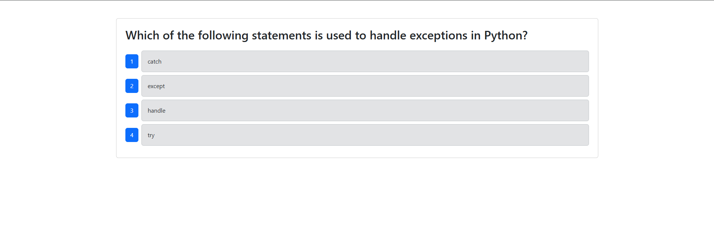

# CI-CD

## Table of Contents
* [Description](#description)
* [Technologies](#technologies)
* [License](#license)
* [Links](#links)
* [Contributions](#contributions)
* [Questions](#questions)

## Description
As a student of Full Stack Web Development, I want to learn how the Continuous Integration/ Continuous Delivery, or Deployment, (CI/CD) process works. I have been provided starter code that contains a functioning full stack quiz project alongside cypress tests. I have implemented a dev.yml which runs testing on components through use of GitHub Actions, when a branch is PR'd into develop & a main.yml which triggers an auto deploy, upon a merge into main. 

Attached is a snippet of the Quiz portion from the Deployed Application on Render:

## Technologies
- React (Vite)
- Node.js
- Express
- MongoDB (via Mongoose)
- Cypress
- GitHub Actions

## License
This project is licensed under the MIT license.

## Contributions
- Stack Overflow, Bootcamp Modules as Reference, Various Google Inquiries, & The Occasional Intercession Of Co-Pilot

## Links
- [GitHub Repository](https://github.com/Bakenavva/CI-CD)
- [Deployed Application](https://ci-cd-29ic.onrender.com/)

## Questions
Further questions can reach me via:
- GitHub: [Bakenavva](https://github.com/Bakenavva)
- Email:  ernestoaleman00@gmail.com
